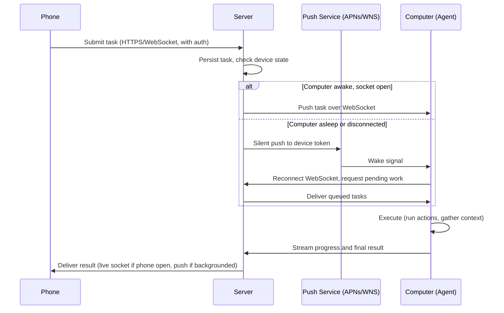

# Phone-to-computer task delivery via a cloud relay: a technical architecture overview

## Abstract

This overview covers the architecture for delivering tasks from a mobile client to a desktop agent through a cloud server, including the case where the desktop is asleep when the task arrives. The current common test setup (phone talking directly to a powered-on computer) does not survive contact with real users, who close laptops, walk away, and expect things to work anyway. The fix is a server in the middle that holds task state, knows which devices are reachable, and uses the operating system's push notification path to wake sleeping computers on demand. The core technical move is Apple Push Notification service (APNs) for macOS, with Windows Notification Service (WNS) as the Windows analog. The rest of the document is the supporting machinery: persistent connections, queueing, idempotency, auth, latency budget, failure modes, and a sensible build order.

## Why direct phone-to-computer fails in production

A direct connection between phone and computer is fine for a demo. It assumes the computer has a reachable network address, that it stays awake, that NAT and firewall rules cooperate, and that the phone and computer are either on the same network or punching through with something like UPnP or a custom tunnel. Each of those assumptions is fragile in the wild. Home routers reassign IPs, carriers block inbound traffic on cellular, laptops sleep when the lid closes, and the user's first instinct after starting a task is to put the phone in their pocket and stop looking at it.

A relay server fixes all of that with one structural change: both endpoints make outbound connections to a known address (the server), and the server brokers messages between them. Outbound connections traverse NAT and firewalls without configuration. The server has a stable public address. Either endpoint can drop off the network without the other endpoint noticing or caring, because the server holds state between them.

The cost is operational. You now run a server. You handle auth, scaling, queueing, and failure recovery. That cost is the right one to pay; the alternatives (peer-to-peer NAT punching, asking users to port-forward, requiring a VPN) cost more in user friction and support load.

## The relay model at a glance

The computer is always an outbound client of the server. There is no inbound path to the computer at any point in the flow. The push service is the only thing that can reach the computer when it is asleep, and it only delivers a wake signal, not a payload of substance. The real payload still travels over the WebSocket the computer opens after waking up.

## What the server actually does

The server has a small set of jobs and it is worth being precise about them, because most early bugs come from one of these being half-implemented.

It authenticates the phone and the computer. Each device has an identity tied to a user account. Tokens are scoped, expiring, and revocable.

It maintains a connection registry. For each user, the server knows which computer(s) currently have an open WebSocket and which it has only a push token for. If the server runs as more than one process or on more than one host, this registry has to be shared (Redis is the usual answer at small scale).

It accepts tasks from the phone, assigns them a unique ID, persists them, and decides whether to deliver them immediately over an active WebSocket or queue them and send a push. The choice is not exclusive; sending a push as a redundant nudge while also pushing over the socket is sometimes the right call when the socket has been quiet for a while.

It receives progress and results from the computer, persists them, and forwards them to the phone. If the phone has a live connection, that path is a WebSocket frame. If the phone app is backgrounded, the path is a notification through the same push infrastructure, which the phone's OS will display or hand to the app on resume.

It handles retries and idempotency. Pushes get dropped sometimes. Connections close mid-message. The server is the only place where retry policy can be implemented coherently, because it is the only component that sees both ends of the flow.

A reasonable first-version stack is one API server, Postgres for durable state, Redis for connection state and pub/sub, and a thin library wrapping the push provider's HTTP API. Nothing exotic. This will hold up well past initial launch, and the parts that need to scale (the WebSocket frontend, the push sender) can be split out later.

## The persistent connection on the computer side

The desktop agent opens a WebSocket to the server as soon as it has network and a valid auth token, and it keeps that socket open as long as the system is awake. The server uses that socket as the hot path: incoming task, push over the socket, the agent picks it up and runs.

The socket carries authenticated, framed messages. Each message has a task ID, a type (task, progress, result, ack, ping), and a payload. Both sides send periodic pings (every 30 to 60 seconds is reasonable) so each can detect a dead peer; the OS's TCP stack will eventually figure this out on its own, but waiting for TCP timeouts to fire is much slower than an app-level keepalive.

Reconnect logic uses exponential backoff with jitter. A flaky cafe wifi should not turn into a tight reconnect loop hammering the server. Three to five seconds for the first retry, doubling up to a minute or so, with random jitter, works well in practice.

When the system goes to sleep, the OS tears the socket down. The agent does not get to gracefully close it; the connection simply ends. The server detects this through either the close frame (best case) or a failed ping (more common). At that point the agent is offline as far as the server is concerned, and any new task has to take the cold path.

## Waking a sleeping computer

This is the part most worth getting right, because it is the only part of the system that depends heavily on operating system behavior and is hardest to test in development.

On macOS, the mechanism is APNs. The agent registers for remote notifications via `UNUserNotificationCenter`, receives a device token, and reports that token to the server. The server stores it against the user. When the server needs to wake the computer, it calls Apple's HTTP/2 push API, signed with a `.p8` auth key from the Apple Developer account, addressed to the device token, with the right `apns-topic` header (the app's bundle ID). Apple's infrastructure delivers the push, the Mac's partially-powered network interface receives it, the system dark-wakes (screen stays off, no UI events), the app's background handler runs for a bounded window of roughly 30 seconds, and the app uses that window to open a WebSocket to the server and pull queued work.

Two push types matter here. A background push has `content-available: 1` and no alert payload. It is silent and intended exactly for cases like this. The catch is that Apple throttles background pushes; expect on the order of a few per hour as a rule of thumb, more in practice but not guaranteed. An alert push has visible content (title, body) and is delivered with higher priority and less throttling, but the user sees a notification, which is usually not what you want for routine task delivery.

The practical pattern is to use background pushes as the default and fall back to alert pushes when a user action explicitly expects a visible response. If the background push gets throttled and the agent does not check in within a timeout, the server can escalate to an alert push, which is the same OS path with slightly different headers.

On Windows, the analog is WNS (Windows Notification Service). The agent (a packaged or sparse-signed app) registers a channel URI, the server pushes to that URI over HTTPS, and the system delivers the message even if the app is suspended. The wake-from-sleep semantics are different and less reliable than macOS in some configurations; on modern Windows with Connected Standby, the mechanism works similarly to APNs background pushes, but on older sleep modes the system may not wake at all without Wake-on-LAN. Plan for both.

Wake-on-LAN deserves a brief mention even though it is rarely the right primary mechanism. It is a magic Ethernet packet that wakes a configured machine, but it requires the sender to be on the same broadcast domain (the same LAN) or to go through a WoL gateway. For a cloud server hitting a random user's home computer, this does not work without help. It is occasionally useful as a fallback inside a corporate network with infrastructure to support it; for a consumer product, ignore it.

Once the computer is awake, you may also want to keep it awake long enough to finish the task. On macOS, the agent should take an IOKit power assertion (`IOPMAssertionCreateWithName` with `kIOPMAssertionTypePreventUserIdleSystemSleep` or `kIOPMAssertionTypeNoIdleSleep`) for the duration of work, then release it. Without an assertion, the system can re-enter sleep at the end of the dark-wake window even if work is still pending. On Windows, the equivalent is `SetThreadExecutionState(ES_SYSTEM_REQUIRED | ES_CONTINUOUS)`. Release the assertion as soon as you can; holding it indefinitely drains battery and irritates users.

## The phone side: connection lifecycle and result delivery

The phone has two states the system has to handle. When the app is open and in the foreground, it can hold an active WebSocket to the server, and results stream back in real time. When the app is backgrounded or the screen is locked, the OS suspends it, the socket dies, and the only way to reach the user is a push notification.

The cleanest model is: when the user opens the app, the phone opens a WebSocket and registers as active. When the app backgrounds, the socket closes and the server falls back to push delivery for any pending or future results. Push payloads to the phone are usually visible notifications (the user wants to know their task is done), but for silent updates (progress, presence, etc.) the background push mode applies on the phone side too, with the same throttling caveats.

The phone needs a device token from APNs (iOS) or FCM (Android), reported to the server the same way the computer's token is. Sometimes a user has multiple phones or multiple computers under one account; the server's data model should treat the user-to-device relationship as one-to-many from the start, even if you only support one of each at launch. Backfilling multi-device support later is annoying.

## Message format and idempotency

Every task gets a unique ID generated by the phone at submission time (a UUID is fine). The server keys all its state on that ID. The computer agent does the same: when it receives a task, it checks whether it has seen this ID before, and if so, returns the prior result rather than re-executing.

This matters because retries are unavoidable. A push gets delivered twice. A WebSocket frame arrives, the agent processes it, but the ack fails because the connection died. The server retries, the agent sees the task again. Without ID-based dedup, the user gets two of whatever they asked for. With dedup, the second delivery is a no-op.

Acks should be explicit. After the agent finishes a task and reports the result, the server should ack receipt of the result; the agent should not consider the result delivered until that ack lands. Similarly, the phone acks results it has displayed, so the server knows when it is safe to drop them from its outbox.

Use a versioned envelope from day one. A two-line schema (`version`, `type`, `task_id`, `payload`) prevents pain later when you need to add a field and discover that some clients are running an old build that throws on unknown keys.

## Authentication and identity

Each user has an account. Each device (phone, computer, possibly more than one of each) is registered to that account during a one-time setup flow, and the device gets a long-lived auth token bound to it. The server stores `(user_id, device_id, device_kind, push_token, auth_token_hash)` tuples.

The phone authenticates to the server with its token on every connection. The computer does the same. The server validates the token, looks up the user, and the connection from that point operates in the user's namespace; the user can only send tasks to their own computers, and receive results from their own tasks.

Push tokens (APNs, WNS, FCM) are separate from auth tokens. The push token is what the OS-level push infrastructure recognizes; the auth token is what your application logic uses. They rotate on different schedules: push tokens can change if the user reinstalls the app or restores from backup, so the agent should re-register its push token on every cold start and the server should accept updates.

Optional but worth designing for early: end-to-end encryption between phone and computer, where the server sees task envelopes (sender, recipient, IDs, timing) but not contents. This is straightforward with a pre-shared key exchanged during device pairing, and it earns you a real privacy story to tell users. Done later it is a larger rewrite, because every payload format and every storage location has to be reconsidered.

## Reliability: queues, retries, ordering

The server treats each user's pending work as a small ordered queue. When the computer is offline, new tasks land in the queue. When the computer reconnects (either because it was already awake and the WebSocket reopened, or because a push woke it), the server delivers queued items in order.

Retry policy lives on the server. For pushes: if the push provider reports a permanent failure (invalid token, app uninstalled), drop the token and mark the device unreachable. For transient failures, retry with backoff. If the agent does not check in within some window after a wake push, retry the push, possibly escalating to an alert push.

Strict ordering across tasks is usually not required. Most user-issued tasks are independent. If your application has tasks that must run in order, mark them with a sequence number and have the agent refuse to run a higher-numbered task before a lower-numbered one has acked.

Avoid unbounded queueing. Cap per-user pending tasks at some reasonable number (say, 50) and reject new submissions when full with a clear error. Otherwise a user with a broken or removed agent will accumulate a wedge of pending work that explodes the next time they reconnect.

## Latency budget

When the computer is awake and has a live socket, end-to-end latency from phone tap to result display is dominated by whatever the task itself does on the computer. The relay path adds maybe 100 to 300 ms (phone-to-server plus server-to-computer round trips), which is invisible to the user.

When the computer is asleep, the cold path adds real latency. Pushing to APNs and getting the wake to fire typically takes 1 to 10 seconds. Dark-wake initialization, reopening a WebSocket, and the server delivering the queued task adds another 1 to 3 seconds. So plan for 5 to 15 seconds before the task even starts executing in the asleep case. P99 will be worse: pushes occasionally take 30 seconds or more, especially under throttling.

This is the latency the UX has to absorb. The right move is to surface state on the phone: "Waking computer," "Task queued," "Running," with progress updates streaming back as soon as they are available. Silent waits feel broken; narrated waits feel like the system is working.

## Privacy and what the server sees

The server is in the middle, which means by default it sees everything: task contents, results, timing, device identifiers. Three positions to consider, in order of increasing rigor.

The pragmatic position: the server is a trusted component, contents are encrypted in transit (TLS) and at rest, access is logged, and the server's role is plainly disclosed in privacy documentation. This is the bar most consumer products meet.

The minimization position: the server stores as little as it can. Task contents are dropped from durable storage as soon as the result is delivered and acked. Long-term logs contain envelope data only.

The end-to-end position: the server cannot read task contents at all. The phone encrypts the task to the computer's public key (exchanged at pairing), the computer decrypts after delivery, results travel back encrypted to the phone. The server still sees who is talking to whom and when, but not what they are saying. This is the strongest position and the most work; it also makes some server-side features (search across history, server-rendered previews) impossible by design.

Pick one early and design to it, because retrofitting any of these is harder than starting there.

## Failure modes worth thinking about now

The computer has no internet at all. Push will not reach it. The task sits in the server queue. When the computer eventually comes back online, the queue drains. Tell the phone the computer is unreachable so the user knows what is happening.

Push delivery silently drops. The server sends the push, gets a 200 from the provider, but the computer never wakes (radio off, OS suppressed it, etc.). Mitigation: if the computer does not check in within a timeout, retry the push. After a few retries, mark the device unreachable and surface a clear error.

The computer wakes, but the dark-wake window closes before the task finishes. Mitigation: the agent takes a power assertion as soon as it starts work, releases it when done. For long tasks, also stream progress so the server (and phone) know the task is alive.

The WebSocket dies mid-task. The agent finishes the work but cannot deliver the result. Mitigation: the agent persists the result locally and tries to deliver again on the next connection. The task ID dedup logic on the server side handles the case where it actually was delivered but the ack got lost.

The phone is offline when the result is ready. The server holds the result, attempts a push, and waits for the phone to come back. On reconnect, the phone fetches anything it missed.

Multiple devices, conflicting state. The user has two phones. They submit a task from phone A. The result has to go to both phones (so phone B sees it too) or just the originating phone (so phone B is not notified about something it did not ask for). This is a product decision more than a technical one, but the data model has to support either choice from the start.

## Suggested build order

Start with the boring middle. Stand up a server with user accounts, device registration, and simple HTTPS endpoints for posting tasks and reading results. No real-time anything yet. Confirm auth works end to end, that you can submit a task from the phone, poll for a result on the phone, and have the computer poll for pending work and post results back. Polling is ugly but it proves the data model.

Add WebSockets next. Replace polling on both ends with a persistent socket and server-initiated pushes. Now the hot path (computer awake) is fast and feels live.

Add the push provider integration. Register device tokens on both phone and computer, send your first silent push, watch it wake a sleeping Mac. This is the moment the system actually does the thing the whole architecture is for. Test it on real hardware with the lid closed and the laptop on battery, because development behavior with a charged-plugged-in Mac in a debugger does not predict production behavior.

Add reliability: task IDs, server-side queueing, idempotent agent execution, explicit acks, retries with backoff. Test by killing connections at every point in the flow and confirming nothing gets lost or duplicated.

Add observability: structured logs on every message with task IDs flowing through, metrics on push delivery latency and success rates, a dashboard you can look at while users are using the system. Without this, you will not be able to tell whether a complaint is an APNs problem, an agent problem, or a phone problem.

After that, the work is mostly product-side: better error messages, multi-device support, fancier privacy options, scaling the server if traffic warrants it. The core architecture is done after the first four steps.

## Open decisions to make explicit

How many computers can one user pair? Most products start with one and grow into many; commit to whichever, and design the routing to match.

Are tasks user-interactive (real-time response expected) or batch (run when convenient)? The architecture handles both, but the UX and the latency budget differ a lot.

What is the offline policy for the agent? Does it cache anything? Can it execute pre-fetched tasks without server contact? For most desktop agents, no, the network round trip is part of the design. For agents that have to work disconnected, the design grows.

What happens during agent updates? When a new version of the agent ships, how is the WebSocket protocol versioned, and how do you avoid breaking users still on the old version? Decide before the second deploy, not the tenth.

Who pays for the server? At small scale, a single VM is enough. At launch scale, it depends entirely on how chatty your protocol is and how many tasks per user per day. Run the math early on push volume; APNs is free but rate-limited, and outbound bandwidth from your server is not.

## Closing

The architecture has three moving pieces (phone, server, computer) and one important trick (using OS push infrastructure as a wake signal for the asleep desktop). Everything else is plumbing: durable queues, idempotent processing, sensible auth, careful reconnection. The trick is the part that does not work in development environments and only behaves correctly in production with real devices on real networks, so test it there as early as possible. Most of the failure modes are recoverable if the server holds task state durably and every message carries an ID; most of the latency in the cold path is unavoidable but can be made bearable with honest UI feedback. Build the boring middle first, add real-time, then add the wake mechanism, then make it reliable. The system is small enough that one focused engineer can put a working version of all four together in a few weeks.
